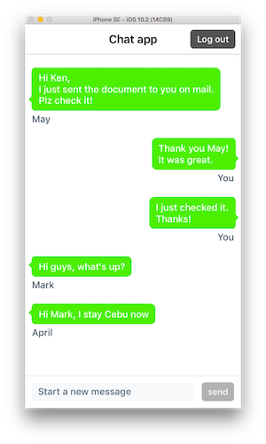

<p align="center">
  
</p>

# simple chat app

 

A simple chat application for iOS powered by a Firebase backend.

## Features

- login and sign-up by username and password
- real-time chat messaging
- a custom built `ChatCollectionViewController` with  customizable speech message bubbles

## Installation

Make sure you have [CocoaPods](https://cocoapods.org/) installed.

```
$ git clone https://github.com/alfonzm/ios-chatapp.git
$ cd ios-chatapp
$ pod install
```

Then open the .xcworkspace file.
